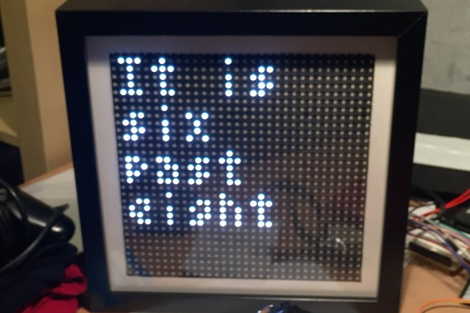

# Internet-of-Things RGB LED Matrix

This repository hosts the software for the 32x32 Internet-of-Things RGB LED Matrix, based on an ESP32 and Arduino IDE. The display data is generated on a server and transferred via MQTT.

# Usage

## Pin connections

The pin assignment is not strict and every pin can be reconfigured to another one, but it is recommended to follow the pinout below so it would work with the unmodified code:

<table>
    <tr>
        <th>Pin</th>
        <th>GPIO</th>
        <th>Reference</th>
    </tr>
    <tr>
        <td>`OE`</td>
        <td>13</td>
        <td rowspan="13"><image src="esp32_pinout.png" /></td>
    </tr>
    <tr>
        <td>`CLK`</td>
        <td>14</td>
    </tr>
    <tr>
        <td>`LAT`</td>
        <td>15</td>
    </tr>
    <tr>
        <td>`CH_A`</td>
        <td>26</td>
    </tr>
    <tr>
        <td>`CH_B`</td>
        <td>4</td>
    </tr>
    <tr>
        <td>`CH_C`</td>
        <td>27</td>
    </tr>
    <tr>
        <td>`CH_D`</td>
        <td>2</td>
    </tr>
    <tr>
        <td>`R1`</td>
        <td>5</td>
    </tr>
    <tr>
        <td>`G1`</td>
        <td>17</td>
    </tr>
    <tr>
        <td>`BL1`</td>
        <td>18</td>
    </tr>
    <tr>
        <td>`R2`</td>
        <td>19</td>
    </tr>
    <tr>
        <td>`G2`</td>
        <td>16</td>
    </tr>
    <tr>
        <td>`BL2`</td>
        <td>25</td>
    </tr>
</table>

## Configuration

The `config_dummy.h` file hosts all the required configuration variables. This file must be renamed to `config.h` before uploading.

* `WIFI_SSID`: Access point SSID
* `WIFI_PASSWORD`: Access point password
* `MQTT_SERVER`: MQTT server address or IP
* `MQTT_PORT`: MQTT server port, default value: `1883`
* `HOST_NAME`: Host name, default value: `IoTRGBLEDMatrix`
* `MQTT_USERNAME`: (optional) MQTT server user name
* `MQTT_PASSWORD`: (optional) MQTT server password
* `MQTT_TOPIC_DISPLAY`: MQTT topic to listen to for the frame updates

The `MQTT_USERNAME` and `MQTT_PASSWORD` definitions are optional, they can be commented out if authentication has not been enabled on the server.

# Build process

[**The project is documented on hackaday.io**](https://hackaday.io/project/28945-iot-rgb-led-matrix-controller-esp32).

# License

This software is licensed under [GNU General Public License](https://en.wikipedia.org/wiki/GNU_General_Public_License).